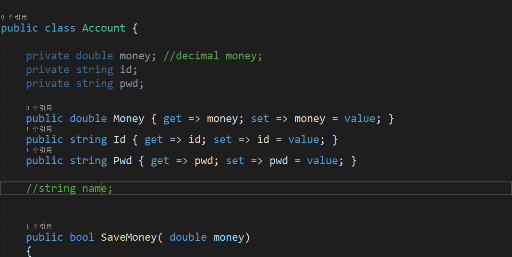

#### 作业解释

1.账户、ATM、银行类中均存在字段和方法

2.如下图使用了属性，并使用了修饰符


3.如代码[CreditCardAccount.cs](./CreditCardAccount.cs)中使用了继承

```C#
using System;
using System.Collections.Generic;
using System.Text;

namespace ConsoleApp3
{
    class CreditCardAccount:Account
    {
        private double creditMoney;

        private bool creditEnabled;

        public double CreditMoney { get => creditMoney; set => creditMoney = value; }
        public bool CreditEnabled { get => creditEnabled; set => creditEnabled = value; }
        
        public void disableCredit()
        {
            this.CreditEnabled = false;
            Console.WriteLine(this.CreditEnabled);
            return;
        }

        public void enableCredit()
        {
            this.CreditEnabled = true;
            Console.WriteLine(this.CreditEnabled);
            return;
        }

        public bool WithdrawMoney(double money)
        {
            Console.WriteLine("你是信用卡，不能取钱");
            return false;

        }

    }
}
```
