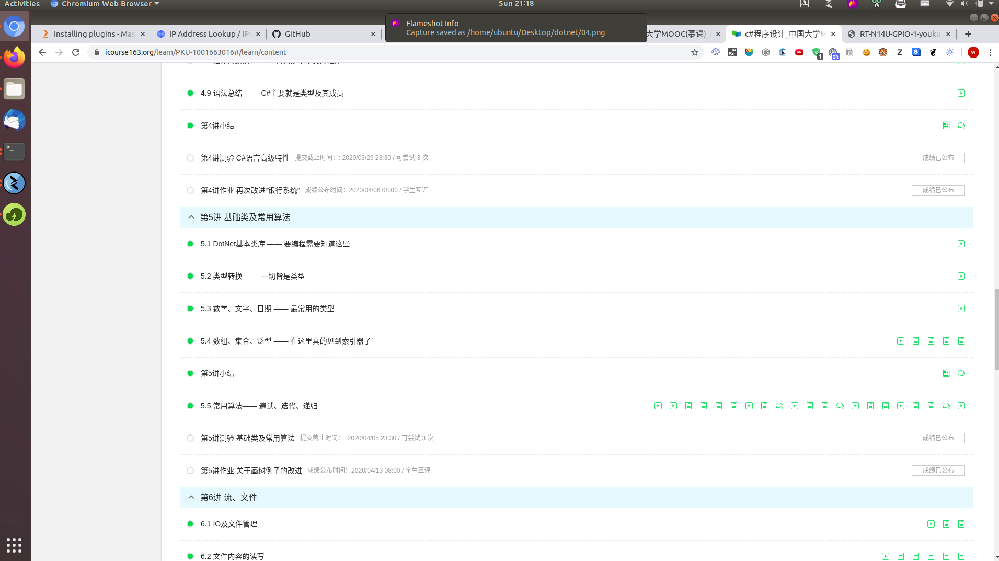

### 项目描述

中国大学MOOC上面dotnet的作业

视频全部看完, 和每个任务点均做完, 具体例证可以查看下方截图

作业为延迟上交, 没有具体的分数, 具体代码老师可以直接看代码

第一章作业: [ConsoleApp3](./ConsoleApp3)

#### Video Study Screenshot

##### 第一章 视频全部完成

##### 第二章 视频全部完成

##### 第三章 视频全部完成 

##### 第四章 视频全部完成

##### 第五章 视频全部完成

##### 第六章 视频全部完成

##### 第七章 视频全部完成

##### 第八章 视频全部完成

#### Exam Score Screenshot

